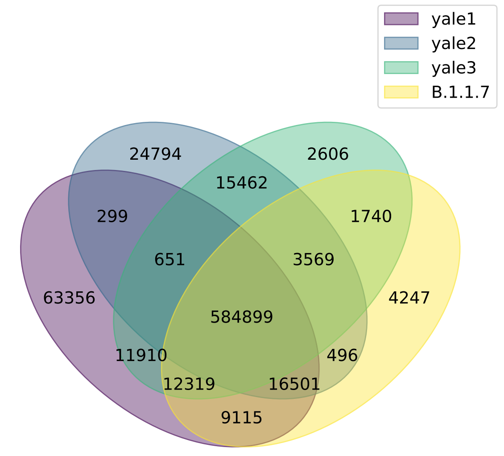
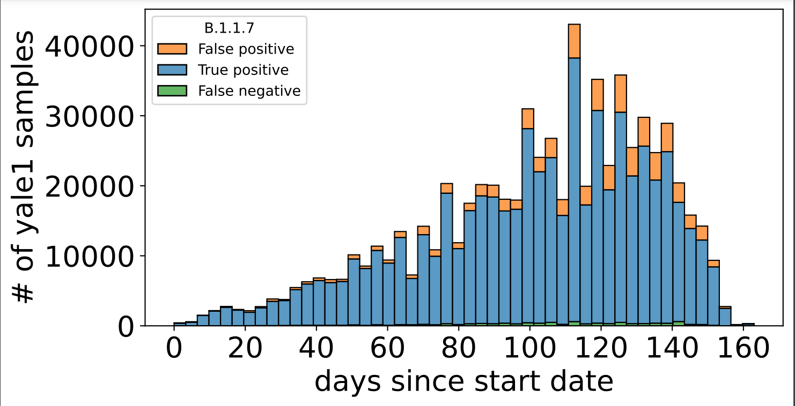

# primer-analysis

This code can be used to probe user-defined target sequences in GISAID sequences of SARS-CoV-2 viruses from COVID-19 patients from around the world.

## Pre-requisites
+ python3 (>=3.6)
+ [numpy](https://numpy.org/doc/)
+ [pandas](https://pandas.pydata.org/pandas-docs/stable/index.html)
+ [seaborn](https://seaborn.pydata.org/)
+ [pyvenn](https://pypi.org/project/venn/)

## Usage instructions

### I/O formats
The main input of this code is as follows --
  1. `fasta` : standard fasta file containing the genomes in which the target sequences need to be probed
  2. `targets` : CSV file with each row being a target sequence and the following columns (fields)
      + 'id': id of the target sequence
      + 'sequence': target sequence in capital letter 'ATCG'
      + 'lineage': the lineage that is being detected using the target sequence
        
     An example of this CSV file is given in `data/target_sequences.csv`.
  3. `meta` : Metadata file containing additional information of each genome in the fasta file. We specifically use the date of collection and the [Pango lineage](https://cov-lineages.org/).

This code has three modes -- `probe`, `analyze` and `plot`.
The output for the `probe` mode of the code is a CSV file that contains information about the presence of the target sequences in each sequence in the input fasta file.
The output for the `analyze` mode of the code is a CSV file that contains statistics like sensitivity and specificity for different combination of tests using the target sequences for each lineage mentioned in the input target sequences file.

### Arguments

    usage: primer_analysis.py [-h] [--probe] [--meta META] [--fasta FASTA]
                              [--targets TARGETS] [--outprobe OUTPROBE]
                              [--condmeta CONDMETA] [--analyze]
                              [--inprobe INPROBE] [--outanalysis OUTANALYSIS]
                              [--outprobemeta OUTPROBEMETA] [--outhtml OUTHTML]
                              [--startdate STARTDATE] [--plot]
                              [--inanalysis INANALYSIS] [--prefix PREFIX]

    optional arguments:
      -h, --help            show this help message and exit
      --probe               probe target sequences
      --meta META           metadata of the SARS-CoV-2 genomes
      --fasta FASTA         fasta file with SARS-CoV-2 genomes
      --targets TARGETS     csv file with target sequences and their probe
                            lineages
      --outprobe OUTPROBE   output file name for updated metadata file
      --condmeta CONDMETA   output file name for condensed form of metadata file
      --analyze             analyze target sequences
      --inprobe INPROBE     input metadata file of probed target sequences
      --outanalysis OUTANALYSIS
                            output csv file with analysis results
      --outprobemeta OUTPROBEMETA
                            output csv file with probing results along with
                            metadata
      --outhtml OUTHTML     output html file with anlaysis results
      --startdate STARTDATE
                            date (YYYY-MM-DD) after which the analysis should be
                            performed [2020-12-01]
      --plot                plot the analysis results
      --inanalysis INANALYSIS
                            csv file with analysis results
      --prefix PREFIX       prefix for output files of plotting

### Example    

If `sequences.fasta` is the fasta file with GISAID sequences and `metadata.tsv` is the metadata file, then the following is an example of probing target sequences, analyzing the results and finally plotting some venn diagrams.

    $ python primer_analysis.py --probe --analyze --plot --fasta ../data/sequences.fasta --targets ../data/target_sequences.csv --meta ../data/metadata.tsv --outprobemeta ../data/output_probe_metadata.csv --outanalysis ../data/output_analysis.csv --prefix ../data/

This is an example of venn figure generated with the above command using GISAID sequences until 15th May 2021.
It shows the overlap of sequences classified as belonging to lineage `B.1.1.7` with three target sequences from the [Yale protocol](https://www.protocols.io/view/multiplexed-rt-qpcr-to-screen-for-sars-cov-2-b-1-1-br9vm966).

This plot shows the number of true positive, false positive and false negative samples for the first target sequence in the Yale protocol. The start date for this plot is 1st December 2020.
